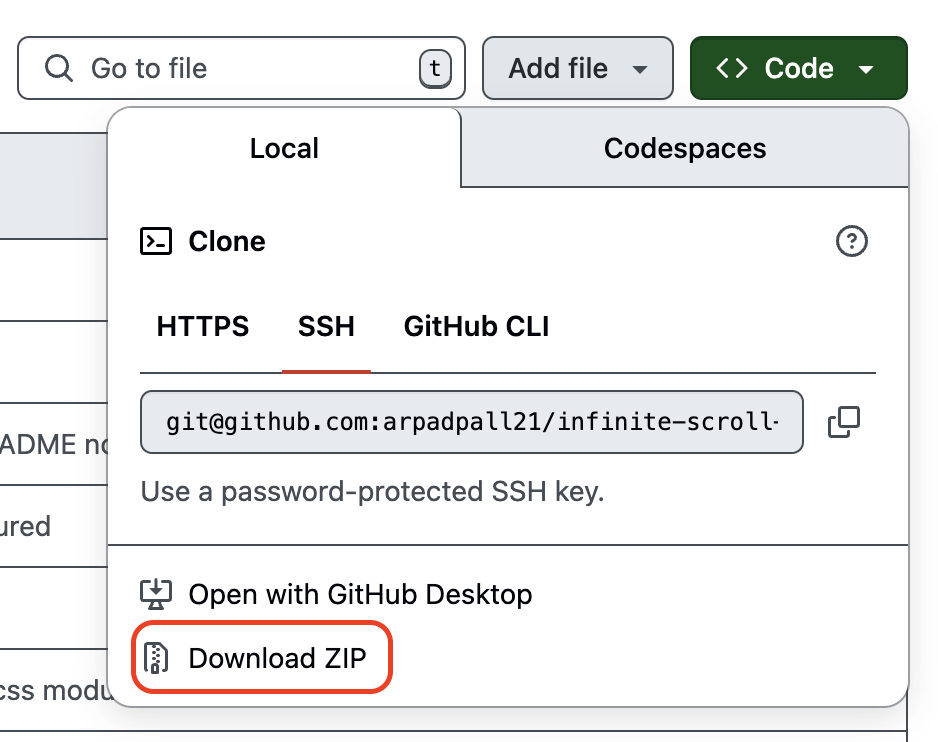

# Investment Calculator With Currency Exchange Support

## Description
- This is an investment calculator that calculates investments for each year based on interest
- The following features are supported:
  - Currency exchange: Different currencies can be passed, and the outcome is calculated in the desired output currency
  - Yearly investment: A sum (per currency) can be passed that will be added at the end of each year
- Designed for an international investor who has investments in different currencies, the initial example describes a scenario where investments are in three currencies: `EUR`, `USD`, and `GBP`. The outcome is then calculated in `EUR`
- Although this is a command-line tool, it's designed to be simple for non-technical people (The input `.toml` file is easy to read and change, and no project installation is required)

## Requirements
 - Python v3.11+

## Setup (for non-technical people)
- Download this program 

- Install Python version 3.11 (or higher) [here](https://www.python.org/downloads/)
- Navigate to the program directory
- Enter your inputs in the `input.toml` file
  - Already existing inputs are for demo purposes that you can easily follow
  - Numbers can be entered as `1325500` or `1_325_500` (the second is easier to read)
  - You can use any currency name you want (ex: `EUR`, `Euro`, `MyCurrency`), but **use the same name per currency**
- Open terminal in the program folder [here](https://johnwargo.com/posts/2024/launch-windows-terminal/)
- Type `python src/main.py` then press `[ENTER]`
